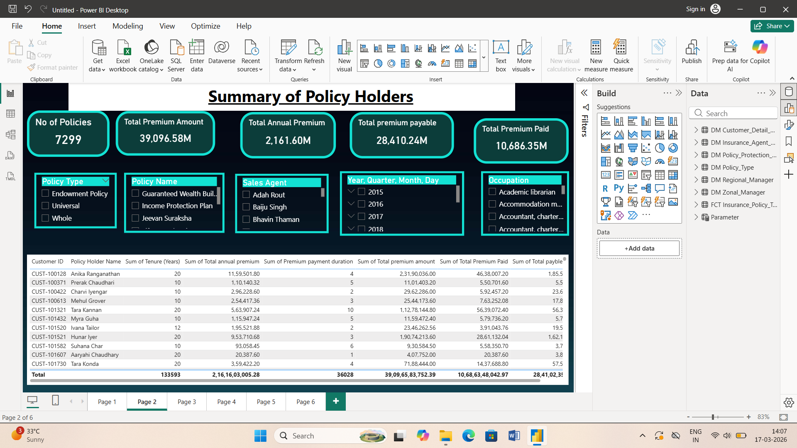
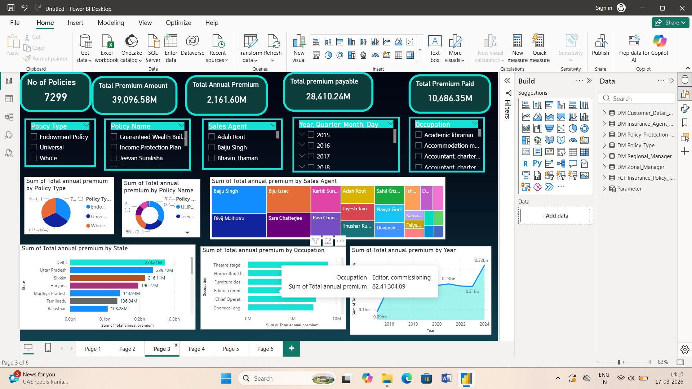
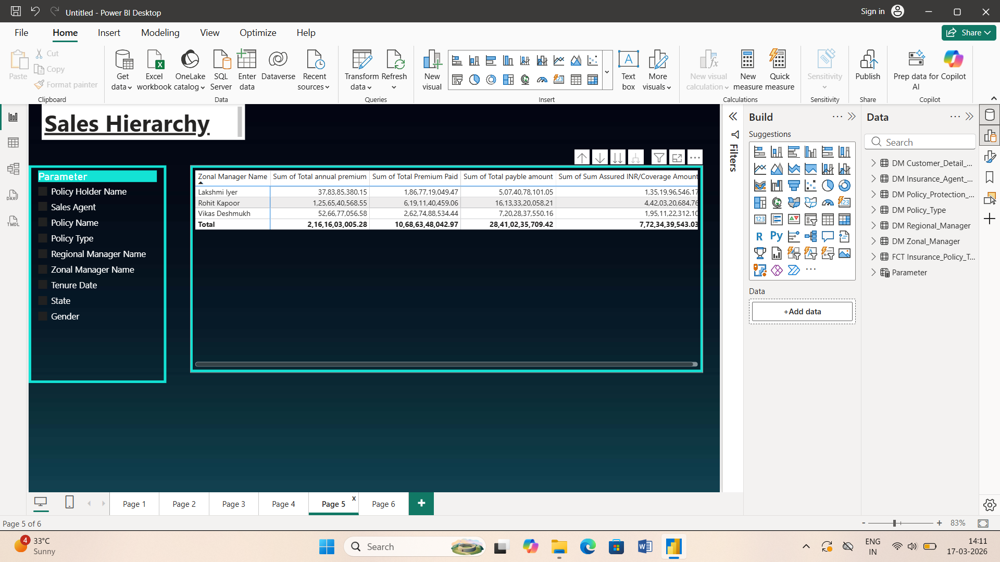
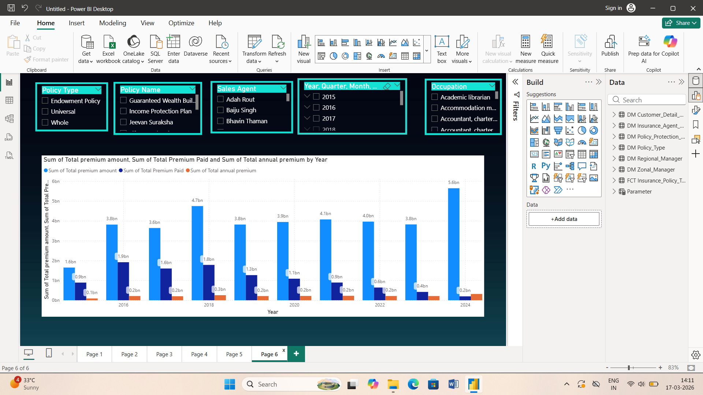

📊 Insurance Policy Analysis Dashboard (Power BI)
📌 Project Overview

This project is built using Microsoft Power BI to analyze insurance policy data.
The dashboard provides insights into policy holders, premium amounts, payments, and sales hierarchy.

📂 Dataset Information

The project uses the following datasets:
1) DM_Customer_Details – Contains customer information like Customer ID, Name, Gender, State, etc.
2) DM_Insurance_Agent – Details of sales agents
3) DM_Policy_Protection – Information about policy protection plans
4) DM_Policy_Type – Types of policies 
5) DM_Regional_Manager – Regional manager data
6) DM_Zonal_Manager – Zonal manager details
7) FCT_Insurance_Policy_Transactions – Main fact table containing premium, payment, and policy transaction data
8) Parameter Table – Used for dynamic filtering (Policy Holder Name, Sales Agent, Policy Type, etc.)

📊 Dashboard Pages
1️⃣ Summary of Policy Holders
Total number of policies
Total premium amount
Total annual premium
Total premium payable
Total premium paid
Detailed table of customer data

2️⃣ Sales & Premium Analysis
Premium distribution by:
Policy Type
Policy Name
Sales Agent
State-wise premium analysis
Occupation-based premium insights
Year-wise trend analysis

3️⃣ Sales Hierarchy Analysis
Zonal Manager → Regional Manager → Sales Agent hierarchy
Metrics:
Total Annual Premium
Total Premium Paid
Payable Amount
Coverage Amount

4️⃣ Yearly Premium Analysis
Comparison of:
Total Premium Amount
Premium Paid
Annual Premium
Year-wise performance trends

🔍 Key Features
Interactive slicers:
Policy Type
Policy Name
Sales Agent
Year / Quarter / Month / Day
Occupation
Drill-down functionality
Dynamic filtering using parameter table
Clean dark-themed UI dashboard

🛠 Tools & Technologies
Microsoft Power BI – Dashboard creation
Microsoft Excel / CSV – Data source
Data Modeling (Star Schema)
DAX (Data Analysis Expressions)

📈 Key Insights
Identifies top-performing sales agents
Tracks premium trends over years
Highlights high-value customers
Analyzes policy distribution across states and occupations

🚀 How to Use
Open the .pbix file in Microsoft Power BI Desktop

Refresh the dataset

Use slicers to filter data

Explore different dashboard pages
## Dashboard Screenshots

